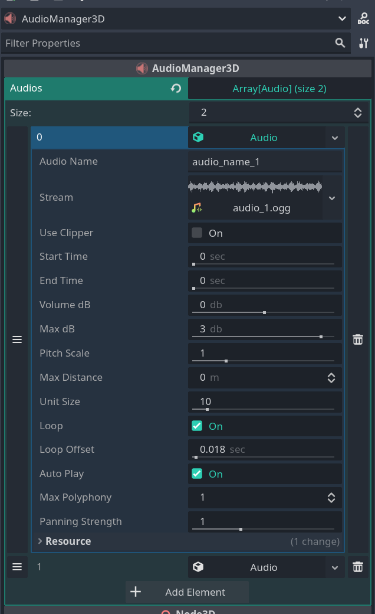

# AudioManager3D - 3D Audio Management for Godot

**AudioManager3D** is a plugin for the Godot Engine that enables advanced 3D audio management in your game. With this plugin, you can easily control and play sounds from a single node, offering options like audio trimming to set start and end times, looping, volume, pitch, distance, and more for each audio track.

## Features

- **3D Audio Management**: Manage audio in a 3D scene using a single node.
- **Audio Trimming**: Trim each audio file by setting a start and end time.
- **Add Looping**: Define loops even for audio files without built-in looping support. You can loop both normal and trimmed audio.
- **Add Loop Offset**: For audio files not designed for seamless looping, you can add an offset at the end of the audio to ensure smooth playback.
- **Playback Control**: Start, pause, and stop audio programmatically by calling it by the defined name.
- **Distance-Based Audio**: Apply volume attenuation based on the listener's distance.
- **Control Pitch, Auto Play, Volume, Max Distance, and More**: Adjust pitch, volume, and other parameters for each audio track directly through the plugin.

## How It Works

The **AudioManager3D** plugin enables management, playback, and control of audio within a single node in a 3D environment. It provides various options to configure audio properties. Parameters are exported to the Godot editor, allowing intuitive control directly from the interface.

## Usage Example

1. **Play Audio**

```gdscript
# To start a 3D audio
AudioManager3D.play_audio("audio_name")
```

2. **Stop Audio**

```gdscript
# To stop an audio
AudioManager3D.stop_audio("audio_name")
```

3. **Pause Audio**

```gdscript
# To pause an audio
AudioManager3D.pause_audio("audio_name")
```

4. **Resume Audio**

```gdscript
# To resume a paused audio
AudioManager3D.continue_audio("audio_name")
```

5. **Play All Audio**

```gdscript
# To play all audio
AudioManager3D.play_all()
```

6. **Stop All Audio**

```gdscript
# To stop all currently playing audio
AudioManager3D.stop_all()
```

7. **Pause All Audio**

```gdscript
# To pause all currently playing audio
AudioManager3D.pause_all()
```

8. **Resume All Audio**

```gdscript
# To resume all paused audio
AudioManager3D.continue_all()
```




## Installation

1. Download the plugin.
2. Extract the plugin files into the `res://addons/` directory in your project.
3. Enable the plugin under `Project > Settings > Plugins` in Godot.

## License

This plugin is available under the [MIT License](LICENSE.md).
